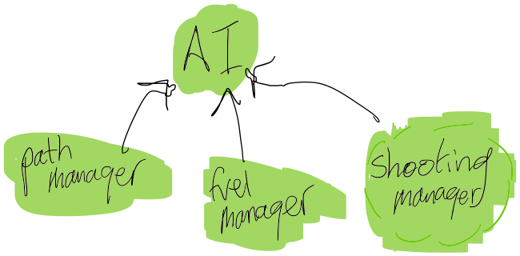

# Design Document

Sam Aronson

### Intro

For this project, the goal is to reach the exit tile before running out of fuel. To reach this goal, managing  fuel consumption is crucial and the primary goal of the AI. In this document, first we will discuss the approach the AI will take to optimize fuel consumption, and then the specific techniques and approaches that will be used for each individual task.

####Fuel Management and Optimization

First, we must understand the factors that affect fuel throughout the game for the AI. These are described in Figure 1 below. *the cost of firing a stone is 3-6 fuel, depending on the directional vector.*

The ways that fuel can be gained is quite simple. An allotment of 30 is given at the beginning of the game, and then 3 fuel is earned for each half second spent in the game. Additionally, healthpacks can be used to increase fuel, but I do not believe that it is cost-effective to seek them.

However, considering that the overall goal of this project is to maximize my grade, we will still be seeking for healthpacks.

Instead, to conserve fuel the following goals will be set for the AI

* Try to move to the exit tile as efficiently as possible using a known location of the exit tile
* Avoid stones and ferrets
* Eliminated ferrets through shooting them
* Seek out healthpacks
* Try to minimize the number of times information about ferret and exit tile locations are quered

###AI Design

The AI wll be designed to execute actions using three components shown in Figure 2: a path manager, fuel manager, and shooting manager.

The fuel manager will ensure that enough fuel has been accumulated for whatever the next task is (be it moving to another part of the map, or waiting to move). The fuel manager will first "save up" fuel to find the healthpacks and approach the nearest one. 

The path manager will determine the path the squirrel should take when it is time to mvoe to either a healthpack or the exit tile

The shooting manager will attempt to track the ferrets and shoot at them.

##### Fuel Manager

The fuel manager will ensure that there is enough fuel stored up by the squirrel to execute whatever the next action will be. This also will include a buffer to account for potential attacks by ferrets. (Currently, it is set at 20 fuel). If there is not enough fuel for the next stage, it will not occur.

##### Path Manager:

The path manager will attempt to generate paths for the AI to execute. It will use the methods built in project 6 to find an acceptable path. It will first attempt to find all of the healthpacks. After, it will seek out the final square.

##### Shooting Manager:

The shooting manager will use the getFerret() method to predict places that the ferret may be. As they are on a fixed path (it is assumed), eventually the ferret will return to the square. When the AI is in line (either in the x or y direction of the ferret), it will launch a barrage of 30 stones to attempt to kill the ferret. This will occur at some point on the path.

### Conclusion

Through tracking stones, I will create an AI that is informed as to where its opponents lie on the map, while still creating an efficient solution to play HaverQuest.
